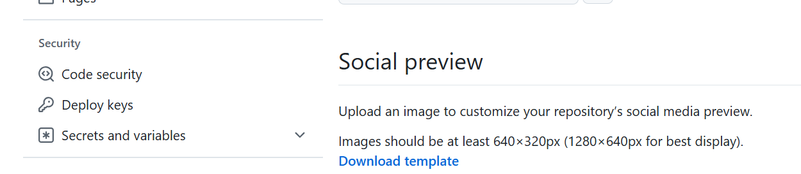
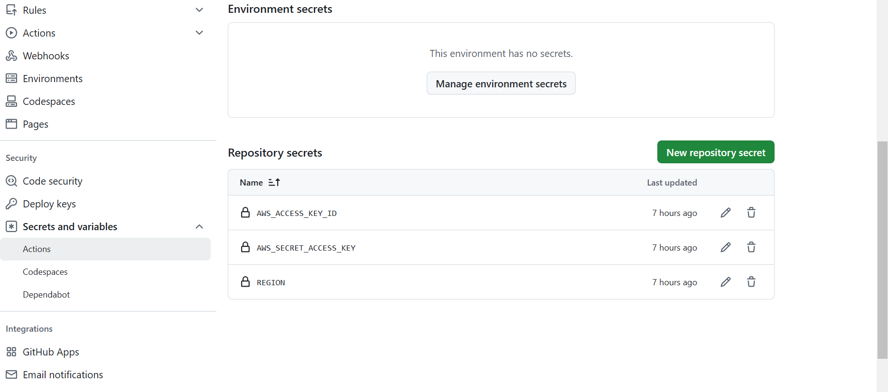
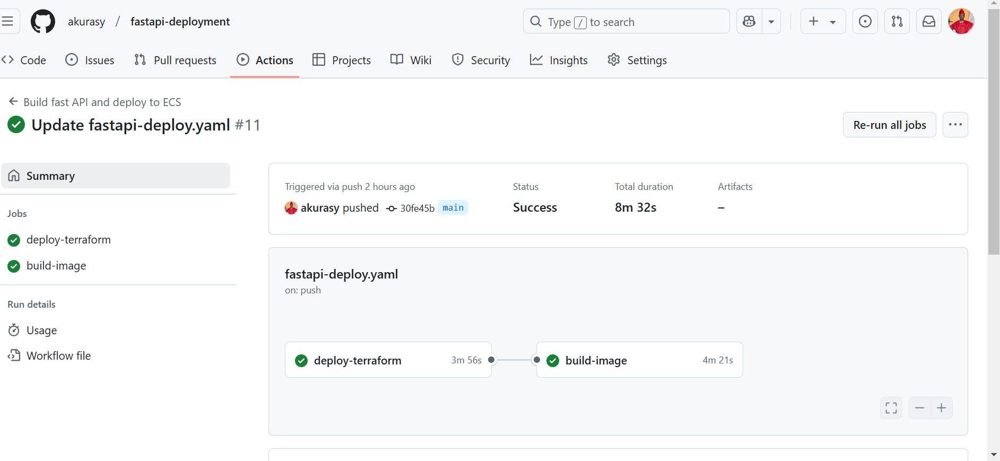
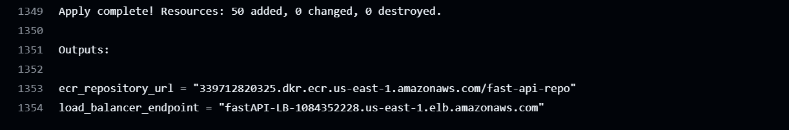
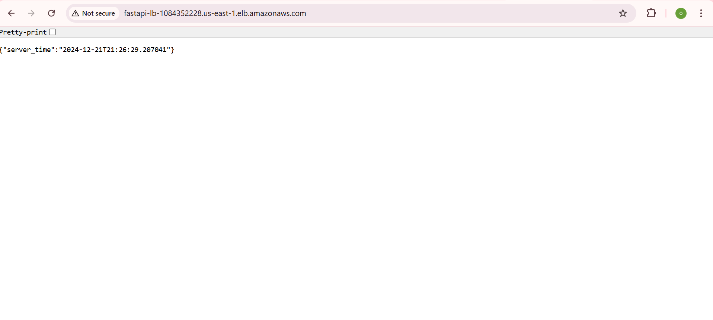
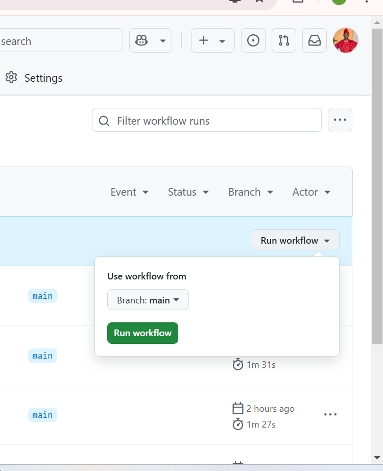
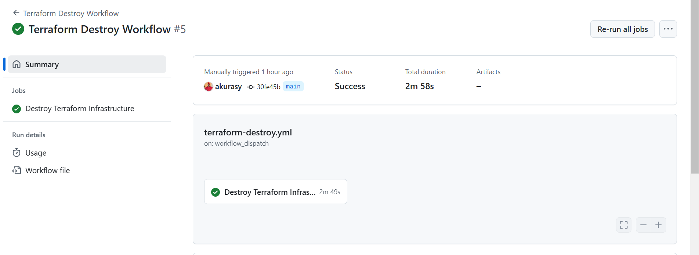

## Build and Deploy FastAPI Application to AWS ECS using Terraform and using Github Actions as CI/CD pipeline

This is a simple FastAPI application that returns the current server time using the load balancer dns url.

This repository contains a GitHub Actions workflow to build a Docker image for a FastAPI application and deploy it to an Amazon ECS cluster. The process uses Terraform for infrastructure setup and manages the entire deployment pipeline with automation. Terraform modules is used to provision the infrastructure for ease, simplicity and to have a reusable code base.

Application: This application is containerized as a Docker image on Amazon ECR private repository  and deployed on AWS ECS. 

## Deployment Structure
The deployment consist of the following components
# Components

| Component                  |  |
|----------------------------|----------|
| 1. VPC                     |    ✅   |
| 2. Private and Public Subnets |  ✅   |
| 3. Route Tables            |    ✅   |
| 4. NAT Gateways            |    ✅   |
| 5. Load Balancers          |    ✅   |
| 6. ECR                     |    ✅   |
| 7. ECS                     |    ✅   |

| Component                  | Required |
|----------------------------|----------|
| 1 ECR IMAGE                     |    ✅   |
| 2 Task Definition |  ✅   |
| 3 Services            |    ✅   |

## Getting Started 

### Prerequisites

Before you begin, ensure you have the following prerequisites in place:

1. **AWS acess key and secret Key Configured**: To interact with AWS services, you'll need to configure your AWS access key and secret key to authenticate with AWS. You can set up access keys from the AWS IAM console.

2.  **A github Account**: To push this repository to github to run the necessary workflow with github runners.

**Fork this repository and create the following secrets for your deployment: AWS_ACCESS_KEY_ID, AWS_SECRET_ACCESS_KEY, REGION and give necessary permission to the IAM user.** 

follow these steps to create a secret:
1. Goto the application repository
2. Goto settings
3. on the lower left, click on secret and variables and click actions
4. create new repository secret






# STEP1- INFRASTRUCTURE PROVISIONING (deploy-terraform)
The workflow is divided into two jobs: deploy-terraform and build and run image. the step one will cover the contents of deploy-terraform job.

in the infrascture provision, aws modules were used to have a simple, dynamic and reusable terraform script. For details on AWS ECS modules, [please visit the official terraform documentation](https://registry.terraform.io/modules/terraform-aws-modules/ecs/aws/latest)

The deploy-terraform job initializes, validates, plans, formats, and applies Terraform configurations to set up AWS infrastructure. 

Terraform key commands in the pipeline: 
```
# Initialize Terraform
terraform init

# Validate Terraform configurations
terraform validate

# Plan infrastructure changes
terraform plan

# Format Terraform files
terraform fmt

# Apply changes with auto-approval
terraform apply --auto-approve
```

The terraform apply command creates a VPC, a Route Table, a NAT Gateway, Load Balancer, Security Group, ECR Repository, ECS Cluster and other object of the ECS cluster like task definition. These resources are created when this pipeline is trigerred. 


# STEP 2 APPLICATION DEPLOYMENT (Build and Deploy Docker Image)
The build-image job builds the FastAPI application into a Docker image, pushes it to Amazon ECR, and deploys the image to ECS.

The ECR and ECS deployment key command in the pipeline:

```
docker build -t $ECR_REGISTRY/$ECR_DOCKER_IMAGE:$IMAGE_TAG .
docker push $ECR_REGISTRY/$ECR_REPOSITORY:$IMAGE_TAG
echo "image=$ECR_REGISTRY/$ECR_REPOSITORY:$IMAGE_TAG" >> $GITHUB_OUTPUT
```
```
aws ecs update-service \
--cluster $ECS_CLUSTER \
--service $ECS_SERVICE \
--force-new-deployment
```
```
echo "Waiting for ECS service to stabilize..."
aws ecs wait services-stable \
--cluster $ECS_CLUSTER \
--services $ECS_SERVICE
```
The above command Builds the Docker image and pushes it to the specified ECR repository. Updates the ECS service with the new image version and ensures the ECS service stabilizes after deployment.


**How to Trigger the Workflow**
The pipeline is triggered on the following events:

Manual Dispatch: Use the "Run workflow" button in GitHub Actions.

Push to main branch: Automatically triggers when changes are pushed to the main branch.




## STEP3 TESTING THE APPLICATI
To view this application, goto the github repository actions to see the workflow, click on the deploy-terraform workflow, scroll down to the terraform apply step and look for the **Load Balancer DNS output** .


Paste the load balancer url in your browser and browse your application. 




## STEP 4: DESTROY INFRASCTRUCTURE
To destroy this infrastruture, the terraform destroy workflow can be trigerred manually. to achieve this;
- click on actions
- click on the terraform destroy workflow file
- click on run work-flow. this will trigger the terraform destroy command. the destroy file contains the following workflow:



```
name: Terraform Destroy Workflow

on:
  workflow_dispatch: # Allows manual triggering of this workflow

jobs:
  terraform-destroy:
    name: Destroy Terraform Infrastructure
    runs-on: ubuntu-latest

    steps:
    - name: Checkout Repository
      uses: actions/checkout@v3

    - name: Configure AWS Credentials
      uses: aws-actions/configure-aws-credentials@v2
      with:
        aws-access-key-id: ${{ secrets.AWS_ACCESS_KEY_ID }}
        aws-secret-access-key: ${{ secrets.AWS_SECRET_ACCESS_KEY }}
        aws-region: us-east-1 # Replace with your AWS region

    - name: Setup Terraform
      uses: hashicorp/setup-terraform@v2
      with:
        terraform_version: 1.5.7 # Replace with your Terraform version

    - name: Initialize Terraform
      working-directory: ./terraform
      run: terraform init

    - name: Destroy Terraform Infrastructure
      working-directory: ./terraform
      run: terraform destroy -auto-approve
```


## THANK YOU FOR READING THROUGH. 
